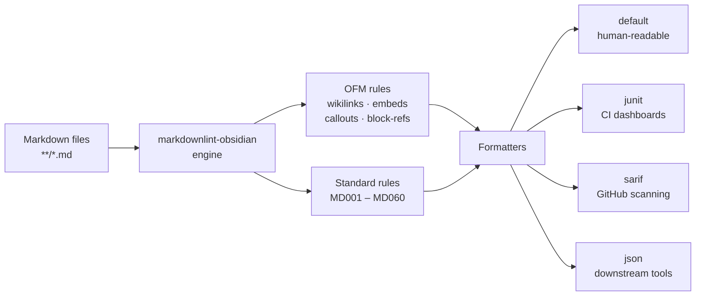

# markdownlint-obsidian

<div align="center">

<picture>
  <source media="(prefers-color-scheme: dark)"
    srcset="../docs/assets/obsidian-linter-logo-dark-transparent.png">
  
</picture>

[](https://www.npmjs.com/package/markdownlint-obsidian)
[](https://www.npmjs.com/package/markdownlint-obsidian-cli)
[](../LICENSE)
[](https://nodejs.org)

</div>

Obsidian Flavored Markdown linter for CI pipelines. Catches broken wikilinks,
unresolved embeds, malformed callouts, block-reference typos, and every standard
`markdownlint` rule — with OFM-aware rule conflicts pre-wired.

> [!NOTE]
> This repo publishes two packages. Most users want the CLI —
> install `markdownlint-obsidian-cli`.

## Packages

| Package | Version | Description |
| :--- | :---: | :--- |
| [`markdownlint-obsidian`](../packages/core) | [](https://www.npmjs.com/package/markdownlint-obsidian) | Programmatic linting API — no CLI dependencies |
| [`markdownlint-obsidian-cli`](../packages/cli) | [](https://www.npmjs.com/package/markdownlint-obsidian-cli) | Command-line interface wrapping the library |

## Install

```bash
# CLI (includes the library as a dependency)
npm install -g markdownlint-obsidian-cli
bun add -g markdownlint-obsidian-cli

# Library only — programmatic API, no commander dep
npm install markdownlint-obsidian
bun add markdownlint-obsidian
```

> [!TIP]
> Node 20+ and Bun 1.1+ are both supported at runtime. Development
> requires Bun 1.1+.

## Quick start

```bash
# Lint every Markdown file under the current directory
npx markdownlint-obsidian "**/*.md"

# Fix auto-fixable issues in place
npx markdownlint-obsidian --fix "**/*.md"

# Machine-readable output for CI dashboards
npx markdownlint-obsidian --output-formatter junit  "**/*.md" > junit.xml
npx markdownlint-obsidian --output-formatter sarif  "**/*.md" > report.sarif
```

The CLI auto-detects the Obsidian vault root by walking up from the
first argument, looking for a `.obsidian` directory. Override with
`--vault-root <path>` or place an `.obsidian-linter.jsonc` at the
project root.

<details>
<summary>Minimal config example</summary>

```jsonc
// .obsidian-linter.jsonc
{
  "vaultRoot": "./",
  "resolve": true,
  "globs": ["**/*.md"],
  "ignores": ["node_modules/**"],
  "rules": {
    "MD013": { "enabled": false }
  }
}
```

</details>

## Pipeline



## CI integration

<details>
<summary>GitHub Actions — lint + upload SARIF to code scanning</summary>

```yaml
- uses: alisonaquinas/markdownlint-obsidian@v0.8.0
  id: lint
  with:
    globs: "**/*.md"
    format: sarif
- uses: github/codeql-action/upload-sarif@v3
  if: always()
  with:
    sarif_file: ${{ steps.lint.outputs.sarif-path }}
```

</details>

<details>
<summary>pre-commit hook</summary>

```yaml
# .pre-commit-config.yaml
- repo: https://github.com/alisonaquinas/markdownlint-obsidian
  rev: v0.8.0
  hooks:
    - id: markdownlint-obsidian
```

</details>

<details>
<summary>Docker</summary>

```bash
docker run --rm -v "$(pwd):/workdir" \
  ghcr.io/alisonaquinas/markdownlint-obsidian:latest \
  "**/*.md"
```

</details>

> [!IMPORTANT]
> See [`docs/guides/ci-integration.md`](../docs/guides/ci-integration.md)
> for GitLab CI, Jenkins, and Azure Pipelines recipes.

## Output formatters

| Formatter | Use when |
| :--- | :--- |
| `default` | Human-readable `file:line:col CODE message` lines |
| `json` | Downstream tooling and custom reporters |
| `junit` | Jenkins, GitLab CI, Azure Pipelines test dashboards |
| `sarif` | GitHub code scanning, SARIF viewers |

## Programmatic API

```typescript
import { lint, fix, getFormatter } from "markdownlint-obsidian/engine";

const results = await lint({ globs: ["**/*.md"], cwd: process.cwd() });

const formatter = getFormatter("sarif");
const sarif = formatter(results);
```

| Export | Contents |
| :--- | :--- |
| `markdownlint-obsidian` | Public API (alias for `/api`) |
| `markdownlint-obsidian/api` | `LinterConfig`, `LintResult`, helpers |
| `markdownlint-obsidian/rules` | Built-in rule definitions |
| `markdownlint-obsidian/engine` | `lint()`, `fix()`, `getFormatter()`, `loadConfig()` |

## Development

```bash
curl -fsSL https://bun.sh/install | bash   # or: npm install -g bun
bun install
bun run test:all
```

## Documentation

- [`packages/core/README.md`](../packages/core/README.md) — programmatic API reference
- [`packages/cli/README.md`](../packages/cli/README.md) — CLI flags and exit codes
- [`docs/roadmap.md`](../docs/roadmap.md) — phased delivery plan
- [`docs/rules/`](../docs/rules) — per-rule catalog (OFM + standard MD)
- [`docs/guides/ci-integration.md`](../docs/guides/ci-integration.md) — CI integration cookbook

## License

MIT © [Alison Aquinas](https://github.com/alisonaquinas)
