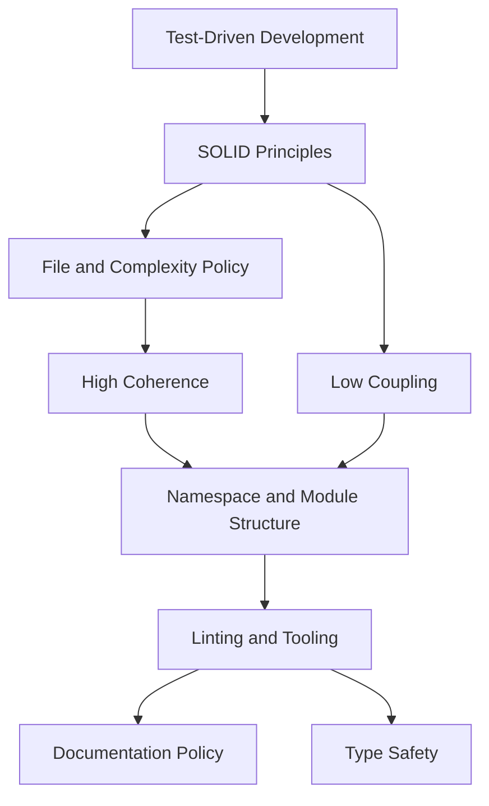

# Architecture Policy

Binding design policies for `markdownlint-obsidian`. These are adapted from
the TinyQuant architecture policy set and translated to this TypeScript/Bun
monorepo.

These policies are not aspirational notes. They define the shape code should
take in `packages/core`, `packages/cli`, `action`, and future extension work.
When a policy conflicts with practical reality, update the policy instead of
silently bypassing it.

## Reading Order

1. [Test-Driven Development](test-driven-development.md)
2. [SOLID Principles](solid-principles.md)
3. [File and Complexity Policy](file-and-complexity-policy.md)
4. [High Coherence](high-coherence.md)
5. [Low Coupling](low-coupling.md)
6. [Linting and Tooling](linting-and-tooling.md)
7. [Documentation Policy](documentation-policy.md)
8. [Type Safety](type-safety.md)
9. [Namespace and Module Structure](namespace-and-module-structure.md)

## Relationship

TDD drives behavior into existence. SOLID provides change-safety heuristics.
File and complexity limits keep units small enough to reason about. Coherence
and coupling shape the dependency graph. Tooling, documentation, and type
safety make the result enforceable.

## Source Note

Imported and adapted from:

`C:\Users\aaqui\better-with-models\TinyQuant\docs\design\architecture`
