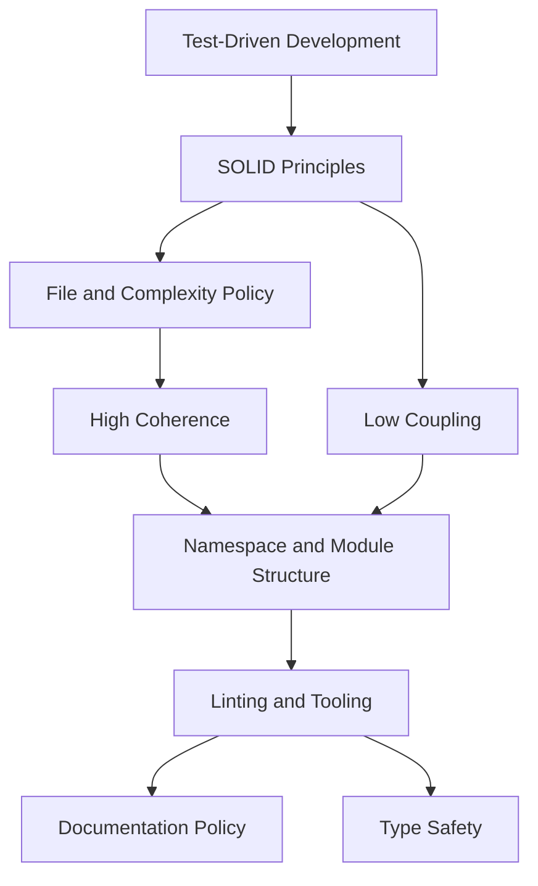

# Architecture Policy

Binding design policies for `markdownlint-obsidian`. These are adapted from
the TinyQuant architecture policy set and translated to this TypeScript/Bun
monorepo.

These policies are not aspirational notes. They define the shape code should
take in `packages/core`, `packages/cli`, `action`, and extension work.
When a policy conflicts with practical reality, update the policy instead of
silently bypassing it.

> [!IMPORTANT] Enforcement path
> These notes connect to [[roadmap]], [[plans/execution-ledger]], and [[rules/index]] so implementation, delivery, and lint behavior stay aligned.

## Reading Order

1. [[architecture/test-driven-development|Test-Driven Development]]
2. [[architecture/solid-principles|SOLID Principles]]
3. [[architecture/file-and-complexity-policy|File and Complexity Policy]]
4. [[architecture/high-coherence|High Coherence]]
5. [[architecture/low-coupling|Low Coupling]]
6. [[architecture/linting-and-tooling|Linting and Tooling]]
7. [[architecture/documentation-policy|Documentation Policy]]
8. [[architecture/type-safety|Type Safety]]
9. [[architecture/namespace-and-module-structure|Namespace and Module Structure]]
10. [[architecture/npm-packages|npm Package Architecture Requirements]]

## Relationship

TDD drives behavior into existence. SOLID provides change-safety heuristics.
File and complexity limits keep units small enough to reason about. Coherence
and coupling shape the dependency graph. Tooling, documentation, and type
safety make the result enforceable.

## Source Note

Imported and adapted from:

`C:\Users\aaqui\better-with-models\TinyQuant\docs\design\architecture`
