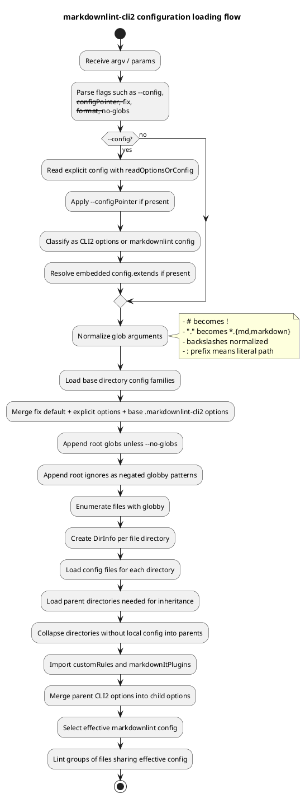

# markdownlint-cli2 Configuration Loading & Parsing Analysis

Source under review: <https://github.com/DavidAnson/markdownlint-cli2>
Repository default branch inspected: `main`
Package version observed in `package.json`: `0.22.1`
Primary implementation file: `markdownlint-cli2.mjs`

## Executive summary

`markdownlint-cli2` uses a deliberately configuration-first architecture. It supports two related but distinct configuration models:

1. **`markdownlint-cli2` options files**: `.markdownlint-cli2.jsonc`, `.markdownlint-cli2.yaml`, `.markdownlint-cli2.cjs`, `.markdownlint-cli2.mjs`
   - These configure the CLI behavior and can embed a `markdownlint` rule `config`.
   - They are inherited down the directory tree and merged with parent options.

2. **`markdownlint` configuration files**: `.markdownlint.jsonc`, `.markdownlint.json`, `.markdownlint.yaml`, `.markdownlint.yml`, `.markdownlint.cjs`, `.markdownlint.mjs`
   - These configure only the underlying `markdownlint` rule configuration.
   - They are not merged by default across directories. The nearest effective one replaces the parent rule config unless `extends` is used.

The loading model is not “read one root config and run.” It builds a directory-to-configuration map for the current working tree, loads configuration files per directory, collapses directories without local configuration into their configured ancestors, then runs linting in groups that share effective configuration.

The most important behavior to understand is precedence:

- `--config` loads an explicit configuration file as a **base** layer.
- The configuration in the current directory is then loaded normally.
- Local `.markdownlint-cli2.*` options override `--config` options at the root.
- Nested `.markdownlint-cli2.*` options merge with parent options.
- A `.markdownlint.*` file overrides the embedded `config` property from `.markdownlint-cli2.*` for that directory.
- Parent `.markdownlint.*` configuration is inherited only when there is no more specific `.markdownlint.*` and no `.markdownlint-cli2.*` `config`.

## Evidence map

Key source files inspected:

| Area | File |
|---|---|
| Package entrypoints and dependencies | `package.json` |
| CLI process entrypoint | `markdownlint-cli2-bin.mjs` |
| Main implementation | `markdownlint-cli2.mjs` |
| Option merge semantics | `merge-options.mjs` |
| CLI2 option key classification | `constants.mjs` |
| JSONC parser | `parsers/jsonc-parse.mjs` |
| YAML parser | `parsers/yaml-parse.mjs` |
| TOML parser | `parsers/toml-parse.mjs` |
| Parser priority list | `parsers/parsers.mjs` |
| User-facing config documentation | `README.md` |
| JSON schema | `schema/markdownlint-cli2-config-schema.json` |
| Validation guidance | `schema/ValidatingConfiguration.md` |
| Behavioral tests | `test/markdownlint-cli2-test-cases.mjs` and related fixtures |

## Public entrypoints

`package.json` defines the package as an ES module package and exposes `markdownlint-cli2.mjs` as the default export target. It also exposes parser modules and markdownlint re-exports. The CLI executable name is `markdownlint-cli2`, mapped to `markdownlint-cli2-bin.mjs`.

The bin wrapper is intentionally thin:

```js
import { "main" as markdownlintCli2 } from "./markdownlint-cli2.mjs";

const params = {
  "argv": process.argv.slice(2),
  "logMessage": console.log,
  "logError": console.error,
  "allowStdin": true
};
try {
  process.exitCode = await markdownlintCli2(params);
} catch (error) {
  console.error(error);
  process.exitCode = 2;
}
```

So the actual configuration-loading and parsing behavior lives in `markdownlint-cli2.mjs`.

## Supported configuration forms

### Per-directory discovery

When scanning directories, the implementation recognizes two fixed-name families.

`markdownlint-cli2` options files, in precedence order:

1. `.markdownlint-cli2.jsonc`
2. `.markdownlint-cli2.yaml`
3. `.markdownlint-cli2.cjs`
4. `.markdownlint-cli2.mjs`

`markdownlint` rule configuration files, in precedence order:

1. `.markdownlint.jsonc`
2. `.markdownlint.json`
3. `.markdownlint.yaml`
4. `.markdownlint.yml`
5. `.markdownlint.cjs`
6. `.markdownlint.mjs`

Only the first existing file in each family is used per directory. The code checks candidate files with `fs.promises.access`, then selects the first fulfilled candidate in the ordered array.

### Explicit `--config` loading

The `--config` path is handled by a broader function, `readOptionsOrConfig`. Unlike per-directory discovery, explicit `--config` can point to:

- Recognized `markdownlint-cli2` option names or name suffixes.
- Recognized `markdownlint` config names or name suffixes.
- Generic supported extensions:
  - `.jsonc`
  - `.json`
  - `.toml`
  - `.yaml`
  - `.yml`
  - `.cjs`
  - `.mjs`

If the file name is not a recognized suffix and does not have one of the generic supported extensions, the implementation throws an “unsupported configuration file” error.

This distinction matters:

- TOML is supported for `--config`, `--configPointer`, and `extends`.
- TOML is **not** supported as an automatically discovered per-directory override.

## Parser behavior

### JSONC

JSON and JSONC are both parsed through the JSONC parser. The parser uses `jsonc-parser` with trailing commas allowed:

```js
const result = parse(text, errors, { "allowTrailingComma": true });
```

If parsing fails, the implementation aggregates parser error codes, offsets, and lengths into a single error message.

Practical implication: `.markdownlint.json` is more permissive than strict JSON because the same JSONC parser path is used.

### YAML

YAML parsing is a thin wrapper over `js-yaml`:

```js
return yaml.load(text);
```

### TOML

TOML parsing uses `smol-toml`:

```js
const tomlParse = (text) => parse(text);
```

### Parser priority for markdownlint config parsing

The exported parser list is ordered:

1. JSONC
2. TOML
3. YAML

That list is passed to `markdownlint`’s config-reading and config-extending paths.

## Configuration type classification

The implementation uses three buckets while reading a `--config` file:

- `options`
- `config`
- `unknown`

Named `.markdownlint-cli2.*` files go directly to `options`.

Named `.markdownlint.*` files go directly to `config`.

Generic-extension files, such as `package.json`, `pyproject.toml`, or an arbitrary `config.yaml`, go to `unknown`. After parsing, the file is classified by top-level keys:

```js
const keys = Object.keys(unknown);
if (keys.some((key) => cli2SchemaKeys.has(key))) {
  options = unknown;
} else {
  config = unknown;
}
```

The CLI2 keys are:

```js
config
customRules
fix
frontMatter
gitignore
globs
ignores
markdownItPlugins
modulePaths
noBanner
noInlineConfig
noProgress
outputFormatters
showFound
```

Important nuance: `$schema` exists in the JSON schema, but it is not part of this runtime classification set. A generic file with only `$schema` and no recognized CLI2 option key would be treated as a `markdownlint` rule config, not a `markdownlint-cli2` options object.

## `--configPointer`

`--configPointer` is applied after parsing/importing but before generic-file classification. It uses JSON Pointer syntax via `jsonpointer.get`.

The implementation maps the possible loaded objects like this:

```js
const objects = [ options, config, unknown ];
[ options, config, unknown ] = objects.map(
  (obj) => obj && (jsonpointer.get(obj, configPointer) || {})
);
```

Behavioral implications:

- The pointer can be used with JSON, YAML, TOML, CJS, or MJS.
- Missing or falsy pointer results become `{}`.
- The selected sub-object is then classified as CLI2 options vs. markdownlint config if it came from a generic-extension file.
- Invalid pointer syntax surfaces as an error; tests explicitly cover invalid JSON Pointer cases.

Examples documented by the project include:

```bash
markdownlint-cli2 --config package.json --configPointer /markdownlint-cli2 "*.md"
```

and:

```bash
markdownlint-cli2 --config pyproject.toml --configPointer /tool/markdownlint-cli2 "*.md"
```

## Module import behavior

CJS/MJS configuration files and string-based module references are loaded through the same `importModule` helper.

For string IDs, it:

1. Expands `~`.
2. Tries `markdownlint`’s `resolveModule` against one or more candidate directories.
3. If that fails:
   - Uses `new URL(id)` for parseable non-absolute URL-like IDs.
   - Otherwise resolves the ID relative to the first candidate directory and converts it to a file URL.
4. Dynamically imports the module.
5. Returns `module.default`.

For non-string IDs, the value is returned directly. This enables CJS/MJS config files to provide direct object/function references instead of module specifier strings.

In `noImport` mode, string-based imports return `null`, but direct object/function values still flow through because only string IDs are suppressed.

## `extends` behavior

Any `config` object with an `extends` property is passed through `markdownlint`’s `extendConfig`.

This happens in two places:

1. During explicit `--config` loading:
   - If the file is a CLI2 options object and has `options.config`, that embedded config is extended.
   - If the file is a plain markdownlint config object, that config is extended.

2. During per-directory `.markdownlint-cli2.*` discovery:
   - If the options object has `options.config`, the embedded `config` is extended relative to that directory.

Test fixtures include a `--config` case where `.markdownlint-cli2.jsonc` embeds:

```jsonc
{
  "config": {
    "extends": "./base.jsonc"
  }
}
```

and `base.jsonc` disables several rules, confirming that embedded config extension is expected behavior.

## Merge semantics

`mergeOptions` is deliberately shallow:

```js
const merged = {
  ...first,
  ...second
};

const firstConfig = first && first.config;
const secondConfig = second && second.config;
if (firstConfig || secondConfig) {
  merged.config = {
    ...firstConfig,
    ...secondConfig
  };
}
```

Consequences:

- Top-level properties from the second object replace the first.
- `config` gets one additional shallow merge level.
- Arrays are replaced, not concatenated.
- Nested rule option objects are replaced, not deep-merged.
- There is no schema-driven merge logic.

Example consequence:

```jsonc
// parent
{
  "config": {
    "MD013": { "line_length": 120, "tables": false }
  }
}

// child
{
  "config": {
    "MD013": { "code_blocks": false }
  }
}
```

The effective `MD013` object would be only `{ "code_blocks": false }`, not a deep merge of all three settings.

## Base configuration merge order

Root/base options are built with:

```js
mergeOptions(
  mergeOptions(
    { "fix": fixDefault },
    options
  ),
  dirToDirInfo[baseDir].markdownlintOptions
)
```

That means:

1. Start with `{ fix: fixDefault }`.
2. Merge explicit options, usually from `--config`.
3. Merge the base directory’s discovered `.markdownlint-cli2.*` file.

Therefore, a local root `.markdownlint-cli2.*` can override settings from an explicit `--config` file.

This is consistent with the README’s wording that the explicit file is used as a base configuration and then the current directory is handled normally.

## File enumeration and directory mapping

The load pipeline is roughly:



### Glob and literal-path behavior

The CLI argument normalization includes several cross-platform behaviors:

- A single dot argument, `.`, becomes `*.{md,markdown}`.
- `#` at the start of a glob is converted to `!` as a negation-friendly alternative for shells that treat `!` specially.
- Backslashes are converted to forward slashes except when escaping fast-glob special characters.
- A leading `:` marks a literal file path and bypasses glob expansion.
- `\:...` is treated as an escaped literal colon.

During file enumeration:

- `globby` runs with `absolute: true`, `cwd` as the base directory, `dot: true`, and `suppressErrors: true`.
- Root `gitignore` / custom ignore-file behavior is passed to globby.
- Literal files are added separately.
- Negated root `globs` can filter literal files.

## Directory inheritance model

Each discovered directory has a `DirInfo` object:

```js
{
  dir,
  relativeDir,
  parent: null,
  files: [],
  markdownlintConfig: null,
  markdownlintOptions: null
}
```

The implementation:

1. Creates a `DirInfo` for the base directory.
2. Creates a `DirInfo` for each directory containing matched files.
3. Walks parent directories for each matched file directory.
4. Loads configuration in each relevant directory.
5. Collapses unconfigured directories into the nearest configured parent.
6. Rebuilds parent references after collapsing.

For files outside the base directory, the base directory configuration is injected as a parent for configuration purposes.

## How final effective config is selected

For each effective directory group:

1. Start with that directory’s own `markdownlintOptions` and `markdownlintConfig`.
2. Walk up configured parents.
3. Parent CLI2 options merge into child CLI2 options.
4. Parent `.markdownlint.*` config is inherited only if:
   - there is no current `.markdownlint.*` config, and
   - the current effective CLI2 options do not have an embedded `config`.
5. Programmatic override options, if supplied by the API path, are merged last.
6. At lint time, the config passed to `markdownlint` is:

```js
config: markdownlintConfig || markdownlintOptions?.config
```

So a `.markdownlint.*` file wins over the embedded `.markdownlint-cli2.*` `config` for that directory.

## Root-only settings

The schema and README describe several settings as valid only at the root:

- `gitignore`
- `globs`
- `noBanner`
- `noProgress`
- `outputFormatters`
- `showFound`

The implementation does not appear to enforce this via runtime schema validation. Instead, root-only behavior is mostly implemented by where the settings are consumed:

- `globs` are read from `baseMarkdownlintOptions` during base option processing.
- root `ignores` are appended to glob patterns for performance during file enumeration.
- `gitignore` / ignore-file behavior is passed into globby during enumeration.
- nested `ignores` still matter later, but they are applied after enumeration and are therefore less efficient.

## Validation

A JSON schema is shipped for `.markdownlint-cli2` options. It includes:

- `$schema`
- `config`
- `customRules`
- `fix`
- `frontMatter`
- `gitignore`
- `globs`
- `ignores`
- `markdownItPlugins`
- `modulePaths`
- `noBanner`
- `noInlineConfig`
- `noProgress`
- `outputFormatters`
- `showFound`

The schema has:

```json
"additionalProperties": false
```

However, the runtime loading path does not appear to validate configuration objects against the schema. The schema is intended for editor assistance and optional external validation. The project’s `ValidatingConfiguration.md` recommends use of `ajv-cli`.

Practical implication: invalid shape or unknown keys may not fail during config loading. They may be ignored, passed through, or fail later depending on how they are consumed.

## Error handling

Parse/import errors are wrapped with the configuration file path where possible:

```js
Unable to use configuration file '<file>'; <underlying message>
```

Important error paths:

- Invalid JSONC: reports JSONC parse errors with offset/length.
- Invalid YAML: reports `js-yaml` parser errors, such as duplicate mapping keys.
- Invalid CJS/MJS: reports aggregate import failure.
- Unsupported `--config` file extension/name: reports the supported naming/extension rules.
- Invalid `--configPointer`: tests expect an `Invalid JSON pointer` error.

Behavioral tests cover invalid files, mismatched syntax/file extensions, redundant config arguments, prefix names, absolute config paths, config pointers, and unknown file classification.

## Behavioral test coverage

The test suite contains broad configuration coverage, including:

- no config
- `.markdownlint.json`
- `.markdownlint.jsonc`
- `.markdownlint.yaml`
- `.markdownlint.yml`
- `.markdownlint.cjs`
- `.markdownlint.mjs`
- `.markdownlint-cli2.jsonc`
- `.markdownlint-cli2.yaml`
- `.markdownlint-cli2.cjs`
- `.markdownlint-cli2.mjs`
- config precedence when multiple files exist
- invalid JSON/YAML/module configs
- mismatched syntax and extension
- `--config` with all supported file types
- `--configPointer` with valid, missing, nested, null, number, and string targets
- `extends`
- root globs and `--no-globs`
- ignores
- gitignore behavior
- literal files
- fix behavior
- custom rules
- markdown-it plugins
- output formatters

This gives relatively strong confidence that the configuration-loading contract is intentional and regression-protected.

## Edge cases and design observations

### 1. Generic file classification can be surprising

A generic file is treated as CLI2 options if **any** top-level key matches a CLI2 option key. That means a generic config file with a key named `config` will be treated as CLI2 options even if the author intended a plain markdownlint config wrapper for another tool.

This is intentional for examples like `package.json` and `pyproject.toml`, but it is worth documenting in integrations.

### 2. `$schema` does not classify a generic file as CLI2 options

The JSON schema includes `$schema`, but `cli2SchemaKeys` does not. A generic JSON file with only `$schema` would not be considered CLI2 options.

### 3. `.json` files are parsed as JSONC

Because `.markdownlint.json` and generic `.json` go through the JSONC parser, comments and trailing commas can be accepted in places users may expect strict JSON.

### 4. TOML support is explicit, not discovered

TOML is available through `--config`, `--configPointer`, and `extends`, but not through automatic `.markdownlint-cli2.toml` or `.markdownlint.toml` discovery.

The tests explicitly include `.markdownlint-cli2.toml` and `.markdownlint.toml` as `--config` cases, not as discovered per-directory config.

### 5. Merge is shallow

The merge behavior is simple and predictable, but users expecting deep merging of rule options may be surprised.

### 6. Runtime validation is light

The runtime loader parses and classifies configuration, but it does not enforce the JSON schema. Consumers building higher-assurance workflows should validate separately with the provided schema.

### 7. Root-only settings are not schema-enforced by location

Settings documented as “root only” are not rejected in nested files. They simply may have no practical effect depending on where the implementation reads them.

### 8. Module import uses default exports

CJS/MJS config and plugin imports return `module.default`. Integrations should ensure modules expose the expected default export shape.

### 9. Explicit config is a base, not an absolute override

This is probably the most integration-relevant nuance. Passing `--config some-file` does not prevent local `.markdownlint-cli2.*` or `.markdownlint.*` files from participating.

## Practical precedence cheat sheet

From lowest to highest precedence for CLI2 options at the root:

1. Built-in default `{ fix: false }` or `--fix` default `{ fix: true }`
2. Explicit `--config` options
3. Base-directory `.markdownlint-cli2.*` options

For nested directories:

1. Parent effective CLI2 options
2. Child `.markdownlint-cli2.*` options
3. Programmatic API override options, if used

For markdownlint rule config:

1. Embedded `config` from effective `.markdownlint-cli2.*`
2. Nearest `.markdownlint.*` file overrides embedded `config`
3. Parent `.markdownlint.*` is inherited only when the current directory has neither `.markdownlint.*` nor embedded CLI2 `config`
4. `extends` is the recommended way to share or merge plain `.markdownlint.*` configurations

## Recommended guidance for integrators

When generating or consuming configuration for `markdownlint-cli2`:

- Prefer `.markdownlint-cli2.jsonc` at project root for full CLI control.
- Use `.markdownlint.jsonc` only when broad compatibility with other markdownlint tooling matters.
- Use `extends` for reusable rule configuration.
- Do not assume nested rule option objects deep-merge.
- Do not expect `--config` to suppress local config discovery.
- Use `--no-globs` when a root config has `globs` but a specific invocation should ignore them.
- Validate with the provided schema in CI if strict correctness matters.
- Avoid generic config files with ambiguous top-level keys unless using `--configPointer`.
- Prefer `--configPointer` for `package.json` and `pyproject.toml` integrations.
- Document that `.json` may behave like JSONC in this tool.
- Treat root-only settings as root-only by convention; do not rely on runtime errors for misuse.

## Configuration-loading mental model

A concise mental model:

```text
argv + optional --config
        |
        v
base options = fix default + explicit config + root .markdownlint-cli2.*
        |
        v
globs expanded -> files found
        |
        v
for each file directory:
  load .markdownlint-cli2.* and .markdownlint.*
  load needed parents
  merge CLI2 options down the tree
  choose nearest applicable markdownlint config
        |
        v
lint file groups with shared effective options/config
```

## Bottom line

`markdownlint-cli2`’s configuration system is flexible and intentionally optimized for per-directory configuration. The design favors fast discovery, shallow merges, explicit file precedence, and compatibility with `markdownlint`’s own `extends` mechanism. For tool authors, the main pitfalls are assuming `--config` is final, assuming deep merge semantics, assuming schema validation happens at runtime, or assuming TOML participates in automatic per-directory discovery.
