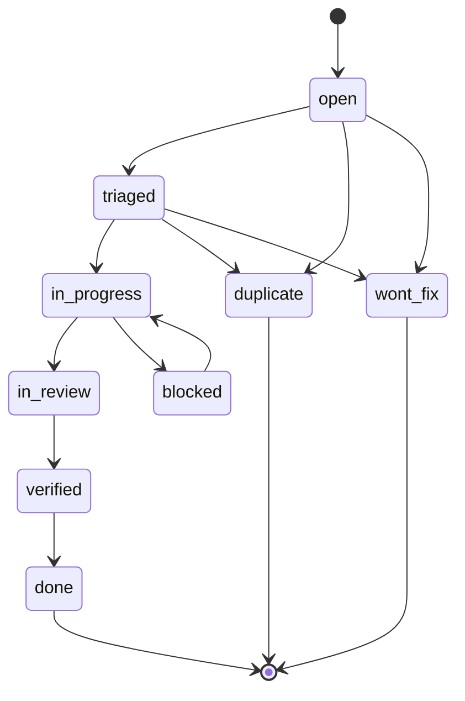

# Bug Ticket Lifecycle

Bug tickets track confirmed defects.

## Rules

- Reproduce before triage.
- Add a regression guard before fixing.
- Close BDD or verification gaps before `done`.
- Use `wont-fix` only with a written rationale.
