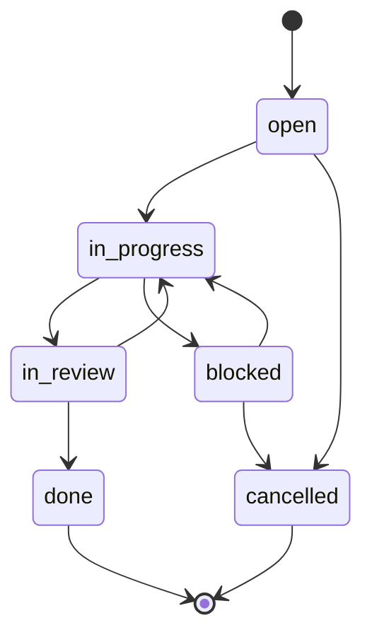

# Chore Ticket Lifecycle

Chore tickets cover maintenance, docs, process, CI, and metadata work.

## Rules

- Keep chores non-behavioral.
- Declare scope before editing.
- Convert to `TASK` if runtime behavior changes.
- Record gate evidence before `done`.
