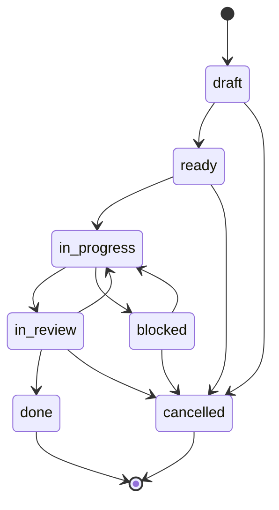

# Feature Ticket Lifecycle

Feature tickets represent phase-level capability delivery.

## States

| State | Meaning | Exit |
| :--- | :--- | :--- |
| `draft` | scope and child tickets still incomplete | all links and child tickets exist |
| `ready` | specified and unblocked | first child task starts |
| `in-progress` | at least one child ticket is active | all child tickets terminal |
| `blocked` | phase cannot move because a dependency is missing | blocker resolves |
| `in-review` | implementation complete, awaiting gate evidence | gate passes |
| `done` | phase work accepted | terminal |
| `cancelled` | phase abandoned with rationale | terminal |
