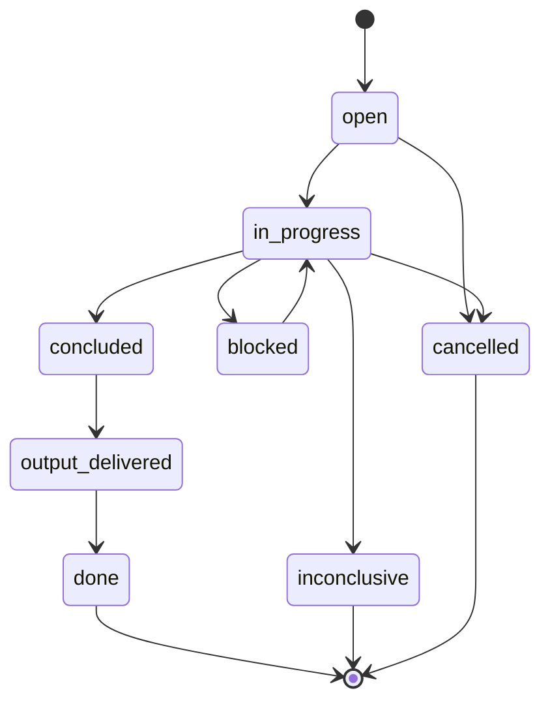

# Spike Ticket Lifecycle

Spike tickets answer one time-boxed question.

## Rules

- One question per spike.
- No production implementation in a spike.
- A spike must deliver an artifact or a follow-up ticket.
- `inconclusive` is valid when findings and next steps are recorded.
