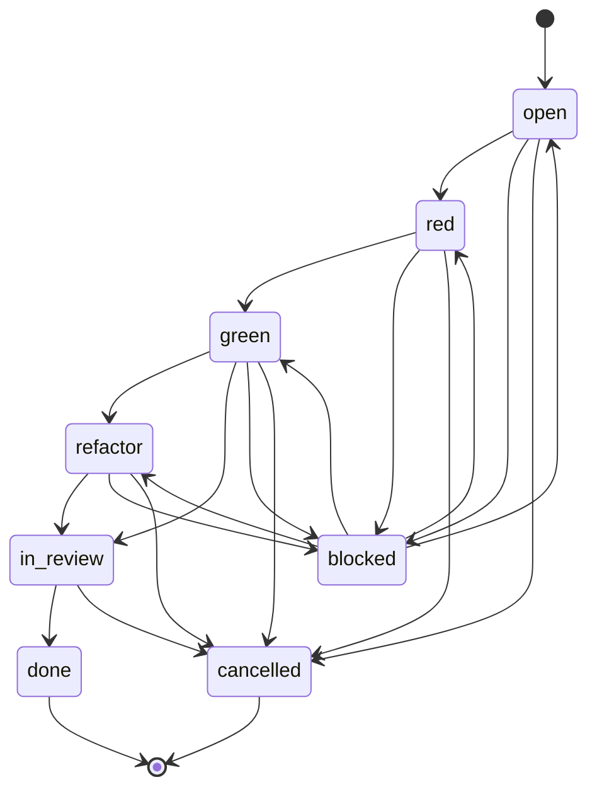

# Task Ticket Lifecycle

Task tickets use a strict test-first lifecycle for behavior changes.

## Rules

- `red` means a failing test or verification check exists.
- `green` means implementation passes that check.
- `refactor` cannot change behavior.
- `done` requires phase gate evidence.
